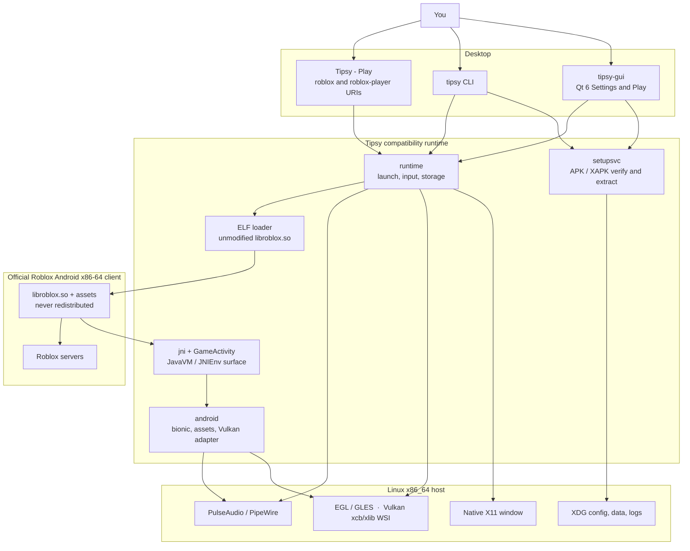

<div align="center">

<h1>
  
  Tipsy
</h1>

**Play the official Roblox client on Linux.**

Tipsy runs the unmodified Android x86-64 Roblox client in a native X11 window.
You bring the APK; Tipsy brings the Android, JNI, and GameActivity runtime the
client needs. Roblox itself is never included, patched, or redistributed.

[](https://tipsyhq.org)
[](https://github.com/32bitx64bit/Tipsy/releases/latest)
[](LICENSE)
[](https://discord.gg/YQkZx8JT6R)

[Website](https://tipsyhq.org)
· [Download](https://github.com/32bitx64bit/Tipsy/releases/latest)
· [Discord](https://discord.gg/YQkZx8JT6R)
· [Contributing](CONTRIBUTING.md)

</div>

---

## Contents

- [Why Tipsy](#why-tipsy)
- [Quick start](#quick-start)
- [Requirements](#requirements)
- [What works](#what-works)
- [Everyday use](#everyday-use)
- [Not supported](#not-supported)
- [For developers](#for-developers)
  - [How it works](#how-it-works)
  - [Command line](#command-line)
  - [Logs, config, and data](#logs-config-and-data)
  - [Build from source](#build-from-source)
  - [Packaging](#packaging)
- [License](#license)

---

## Why Tipsy

There are other ways to run Roblox on Linux. Tipsy takes a particular approach:
the official Android client, a runtime we wrote ourselves, and stable releases
that get actually played before they get tagged.

<table>
<tr>
<td width="33%" valign="top">

**Our own runtime**

The ELF loader, JavaVM/JNI, GameActivity support, X11 windowing, EGL and
Vulkan, input, and audio are Tipsy code, licensed GPL-3.0-or-later. No vendored
internals from another stack.

</td>
<td width="33%" valign="top">

**The real client, untouched**

The same `libroblox.so` Google Play ships. Tipsy never patches the engine,
never ships Roblox bytes, and never asks you to run a Windows build under a
wrapper.

</td>
<td width="33%" valign="top">

**Tested, not theoretical**

Stable tags are playtested by the maintainer first: login, Home, public
experiences, text, input, and audio. If it is listed under
[What works](#what-works), a stable build is expected to do it. Nightlies and
source trees are development territory.

</td>
</tr>
</table>

The host is Go-first with Qt 6 for Settings/Play, X11-first on the desktop. We
implement the Android APIs the client actually asks for, not a speculative
re-creation of Android.

---

## Quick start

Three steps. Roblox is installed inside Tipsy, never shipped with it.

### 1. Install Tipsy

**Distro packages (recommended).** One script detects Debian/Ubuntu,
Fedora/RHEL, Arch/CachyOS, and Flatpak:

```sh
curl -fsSL https://32bitx64bit.github.io/Tipsy-repo/install.sh | sudo bash
```

Want to see what it runs first? Read the
[repository install guide](https://github.com/32bitx64bit/Tipsy-repo/blob/main/docs/INSTALL.md).

**AppImage.** Works on any distro, no repository needed:

```sh
chmod +x Tipsy-*-x86_64.AppImage
./Tipsy-*-x86_64.AppImage
```

Grab the file from
[Releases](https://github.com/32bitx64bit/Tipsy/releases/latest). Official
builds need a CPU with AVX2 (Intel Haswell 2013 or newer, AMD Excavator 2015 or
newer). If the AppImage quits immediately, that is the usual reason.

### 2. Install the Roblox client

Open **Tipsy - Settings**. On first launch the setup assistant runs on its own.

1. Choose **automatic download**, or point it at **local files** you obtained
   lawfully (a backup from a Play-enabled device, an XAPK, and so on).
2. Let Tipsy verify and extract the official x86-64 package.

Only a cryptographically verified `com.roblox.client` containing
`lib/x86_64/libroblox.so` is accepted. ARM-only builds, Windows Roblox, Studio,
and store installer stubs are rejected. If you already have a package on disk:

```sh
tipsy setup /path/to/com.roblox.client.xapk
tipsy doctor
```

Updating the client later does not touch your stored account data.

### 3. Play

- **Tipsy - Play** starts the client.
- You can also click Play on [roblox.com](https://www.roblox.com); the installer
  registers `roblox:` and `roblox-player:` handling for you.
- Sign in inside Roblox's own UI. Tipsy never asks for a password, cookie, or
  `.ROBLOSECURITY`.

From a terminal:

```sh
tipsy-gui          # Settings and first-run setup
tipsy launch       # the official client on X11
```

---

## Requirements

| | |
| --- | --- |
| **OS** | Linux on x86_64-v3 (AVX2) |
| **Display** | Native X11 with `DISPLAY` set. Tipsy is not a Wayland client, though an Xwayland session can work. |
| **GPU** | Mesa (or equivalent) EGL / OpenGL ES. Vulkan is used when Auto sees a complete host path. |
| **Audio** | PulseAudio, or PipeWire's Pulse server |
| **Roblox** | The official Android x86-64 client, obtained separately |

---

## What works

Tipsy is under active development. This list reflects a current official x86-64
client on Linux X11.

<table>
<tr>
<td width="50%" valign="top">

**Play**

- Official login in a native X11 window, signed in through Roblox's own UI
- Session kept across quit and relaunch, like the Android client keeps it
- Public experiences: rendering, keyboard, mouse, networking, audio
- Website Play through `roblox-player:`, `roblox://`, and `https://www.roblox.com/games/...` links
- Two launchers: **Play** goes straight in, **Settings** is setup and configuration

**Graphics and window**

- OpenGL ES via EGL on X11
- Vulkan when the host loader, a physical device, and xcb/xlib WSI are all present (Auto prefers it)
- Focused text (login, Home search, in-experience chat) on the official keyboard path, including compositor-off Vulkan
- Resize, EWMH fullscreen, DPI-aware placement, default-monitor setting
- Frame rate: Auto, Limited (30 to 240), or Unlimited (an uncapped request, not a promised FPS)
- Independent VSync, off by default
- High-quality textures by default, with an optional low-texture mode to save memory

</td>
<td width="50%" valign="top">

**Input and audio**

- Keyboard, including held-key repeat
- Mouse, including captured relative look (right mouse / shift-lock)
- Gamepads over evdev: Xbox, DualShock, DualSense, Switch Pro, 8BitDo, and similar (Bluetooth pairing is your desktop's job)
- Game audio through PulseAudio or PipeWire
- Voice chat for eligible accounts, hear and talk
- Optional Discord Rich Presence, off by default

**Setup**

- Qt 6 setup wizard and settings window
- Cryptographic APK and signing-identity checks
- Local APK, APKM, XAPK, APKS, ZIP, or split sets
- Optional APKPure download as transport, then the same official-package verification
- CLI inspect, compare, doctor, and launch tools

</td>
</tr>
</table>

---

## Everyday use

**Launchers**

| Launcher | What it does |
| --- | --- |
| **Tipsy - Play** | Starts the official client. Owns `roblox:` / `roblox-player:` website Play links. |
| **Tipsy - Settings** | Setup wizard, renderer, FPS, VSync, display, controllers, diagnostics. |

**Settings that need a Roblox restart**

These live in **Tipsy - Settings** and in `~/.config/tipsy/client-settings.json`.

| Setting | Behavior |
| --- | --- |
| Renderer | Auto (Vulkan when the full path exists, otherwise OpenGL), OpenGL, or Vulkan |
| Frame rate | Auto, Limited 30 to 240, or Unlimited (not a promised FPS) |
| VSync | Off by default; independent of the FPS cap |
| Low texture mode | Off by default (high quality); on saves memory/VRAM |
| Default monitor | Main monitor, a named output, or follow-mouse placement |
| Start fullscreen | A window request Tipsy makes at map time, not Roblox's in-app fullscreen toggle |
| Discord Rich Presence | Off by default; the optional join button stays off unless enabled |

**Controllers**

Most pads just work on a local graphical login (logind `uaccess` on
`/dev/input`). If the client sees no controller:

1. Plug in or pair the pad in your desktop's Bluetooth settings.
2. Run `tipsy diagnose gamepad`, or use the diagnostics in Settings.
3. On permission errors: log in locally (not over a bare `ssh` session), or run
   `sudo usermod -aG input "$USER"` and log back in. Never run Tipsy as root.

Flatpak needs device access (`--device=all` on Flatpak 1.14). Existing installs
can opt in with Flatseal or:

```sh
flatpak override --user --device=all io.github.tipsy_linux.Tipsy
```

**Microphone and voice chat**

If the game cannot hear you, unmute **Roblox microphone** in `pavucontrol` or
your desktop mixer. The in-game device list only offers the host default; pick
the source on the desktop, or pin it with `TIPSY_MICROPHONE_SOURCE`.

**More than one install**

A Flatpak and an AppImage can coexist. One install owns the menu and `roblox:`
links at a time, and an AppImage only adds itself to the menu when nothing else
provides Tipsy. Check **Settings → Desktop integration** (or run
`tipsy desktop status|adopt|release`) to see which install your menu opens.

Source builds and `--mode developer` AppImages show up as **Tipsy-Dev** and
never take over the launcher of an official install.

Updates come through `apt upgrade`, `dnf upgrade`, `pacman -Syu`, or
`flatpak update`. The AppImage updates itself in-app.

---

## Not supported

| | |
| --- | --- |
| Windows Roblox, Wine, or Roblox Studio | Out of scope |
| ARM-only or tampered packages | Rejected |
| Native Wayland | X11-first; use an X11 session or Xwayland |
| Cheats, injectors, executors, anti-cheat bypass | Never |
| Shipping Roblox APKs or `.so` files | Never |
| Joining a second place while the client is running | Not wired up yet |
| Horizontal mouse wheel | Captured, but the current Android client only reads vertical scroll |
| `tipsy repair` | Use `tipsy setup` to re-extract |

We do not claim performance comparisons against other Linux Roblox runtimes
until we have measured them. Tipsy never collects Roblox credentials.

---

## For developers

[Contributing](CONTRIBUTING.md) is the engineering contract. The rest of this
page covers how the runtime is structured, how to drive it from a terminal, and
how to build it yourself.

### How it works

Tipsy is not a Roblox reimplementation, a Wine wrapper, or a full Android
emulator. It is a compatibility runtime: the official Android x86-64
`libroblox.so` Google Play ships, running as a native Linux process.

| Layer | Owner | Role |
| --- | --- | --- |
| Host UI | Tipsy | Qt 6 Settings / Play, XDG paths, diagnostics. No game logic. |
| Package gate | Tipsy | Inspects APK / XAPK / splits, checks the Roblox signing identity and x86-64 ABI, extracts into `~/.local/share/tipsy/`. |
| Window and GPU | Tipsy | Real X11 window; EGL/GLES or Android Vulkan WSI on xcb/xlib. |
| Loader | Tipsy | Maps the unmodified ELF (`PT_LOAD`, RELA, APS2 packed RELA) and resolves `DT_NEEDED` Android sonames to host shims. |
| Android / JNI | Tipsy | Enough bionic, JNI, and GameActivity for the official client to start, log in, and present. Missing APIs fail loudly. |
| Roblox | Roblox | Login, Home, networking, experiences. Tipsy does not patch `libroblox.so` and does not ship it. |

Packages built by GitHub Actions (AppImage, Flatpak, `.deb` / `.rpm` / pacman
from the signed repository) present as verified Tipsy releases. A local build
of any medium does not; it asks for `--development` on first launch. See
[Build from source](#build-from-source).



**What happens on a normal Play**

1. **Authority**: a GitHub-built AppImage, Flatpak, or repository package, or explicit development consent for a local build.
2. **Generation**: a previously verified extract from `tipsy setup`.
3. **X11**: the window is mapped (optionally fullscreen) before any guest code runs.
4. **Graphics**: EGL on X11, or Vulkan Auto when the complete WSI path exists.
5. **Load**: map official `libroblox.so`, run constructors, `JNI_OnLoad`.
6. **GameActivity**: `initializeNativeCode` and the official start path.
7. **Present**: Roblox draws; Tipsy pumps X11, input, and audio around it.

The GUI (`cmd/tipsy-gui`) is presentation only. Package provenance, extraction,
client settings, and launch all live in shared Go packages used by both `tipsy`
and `tipsy-gui`.

### Command line

```
tipsy doctor              Host overview (OS, X11, GPU, audio, Qt, gamepad, install)
tipsy inspect <apk...>    Inspect official APKs / splits
tipsy setup <apk...>      Verify and install
tipsy launch [--probe] [uri]
tipsy diagnose [subsystem]
tipsy diagnose-native <lib.so>
tipsy compare-roblox <old> <new>
tipsy report <apk...>
tipsy config              Show or edit XDG config
tipsy desktop             status | adopt | release | render
tipsy logs                Log directory and TIPSY_LOG help
tipsy version
```

Source-build flags: `tipsy setup --development`, `tipsy launch --development`.

`tipsy diagnose` subsystems: `x11`, `graphics`, `audio`, `jni`, `loader`,
`roblox`, `auth`, `gamepad` (aliases `pad`, `controller`).

Machine-readable output: `tipsy inspect --json`, `tipsy report --json`,
`tipsy doctor --json`.

```sh
tipsy launch --probe
tipsy launch 'roblox-player:1+launchmode:play+...'
DISPLAY=:0 tipsy launch --development
```

`--probe` loads the library and runs `JNI_OnLoad` only, no game loop. Studio
URIs are rejected. A website Play URI carrying an official authentication
ticket signs the Android session in through the same private cookie store as
in-app login. Ticket and cookie values are never logged.

One-launch OpenGL visual test (does not persist renderer settings):

```sh
TIPSY_TEST_RENDERER=opengl tipsy launch
```

### Logs, config, and data

XDG layout, overridable with the usual `XDG_*_HOME` variables:

| Path | Typical location |
| --- | --- |
| Config | `~/.config/tipsy/` (`config.json`, `client-settings.json`) |
| Client install | `~/.local/share/tipsy/` |
| Logs | `~/.local/state/tipsy/` |

```sh
TIPSY_LOG=all TIPSY_LOG_LEVEL=debug tipsy launch
```

`TIPSY_LOG` takes a comma-separated category list or `all`. Categories include
`apk`, `loader`, `elf`, `android`, `jni`, `gameactivity`, `x11`, `graphics`,
`input`, `audio`, `network`, `auth`, `filesystem`, `qt`, and `runtime`.

Diagnostics never print passwords, cookies, tokens, or `.ROBLOSECURITY`.

<details>
<summary>Controller and microphone environment (optional)</summary>

The environment wins over the matching section in the settings file. Missing
JSON uses defaults.

```
TIPSY_GAMEPAD=0                    Whole subsystem off
TIPSY_GAMEPAD_DEADZONE=0.0-0.5     Stick deadzone floor
TIPSY_GAMEPAD_INVERT_Y=1           Invert both stick Y axes
TIPSY_GAMEPAD_RUMBLE=0|1           Rumble preference
TIPSY_GAMEPAD_DEBUG=1              Per-event logging (off by default)

TIPSY_MICROPHONE=0                 Capture off
TIPSY_MICROPHONE=1                 Force on
TIPSY_MICROPHONE_SOURCE=<name>     Pin a Pulse source (unset = host default)
```

`tipsy diagnose` never prints Pulse source names or input values.

</details>

### Build from source

> [!NOTE]
> The target is Linux x86_64-v3 (`GOAMD64=v3`, AVX2). The CLI is Go-first, and
> the GUI uses Qt 6 through [MIQT](https://github.com/mappu/miqt). Both
> binaries use cgo against X11, EGL/GLES, Pango/Cairo, and PulseAudio. Vulkan
> development headers are not required; the Vulkan path `dlopen`s the host
> loader at runtime.

GitHub Actions runs `gofmt`, `go vet`, the full `go test` suite under Xvfb, and
CLI/GUI builds on Ubuntu 22.04, Ubuntu 24.04, Debian Bookworm, and Fedora 43.
(Ubuntu 22.04's `qt6-base-dev` 6.2.4 ships no Qt 6 pkg-config files, so CI
synthesizes them from `qmake6`.)

| Tool | Version |
| --- | --- |
| Go | 1.27.1 (matches `go.mod` and CI) |
| C compiler | `gcc` or `g++` |
| pkg-config | needed for the native libraries and the Qt GUI |

Install Go from [go.dev/dl](https://go.dev/dl/) if your distro's package is
older.

<details>
<summary>Distribution packages</summary>

**Debian / Ubuntu** (the same set CI uses):

```sh
sudo apt-get update
sudo apt-get install -y gcc g++ pkg-config \
  libx11-dev libx11-xcb-dev libxext-dev libxrandr-dev libxtst-dev libxi-dev libxdamage-dev \
  libegl1-mesa-dev libgles2-mesa-dev libgl1-mesa-dev libcairo2-dev \
  libpango1.0-dev libpulse-dev \
  libgtk-3-dev libwebkit2gtk-4.1-dev libvulkan-dev \
  qt6-base-dev qt6-base-dev-tools
```

**Fedora**

```sh
sudo dnf install golang gcc gcc-c++ pkgconf-pkg-config \
  qt6-qtbase-devel \
  libX11-devel libXext-devel libXrandr-devel libXtst-devel libXi-devel libXdamage-devel \
  mesa-libEGL-devel mesa-libGLES-devel mesa-libGL-devel \
  pango-devel cairo-devel pulseaudio-libs-devel \
  gtk3-devel webkit2gtk4.1-devel vulkan-headers vulkan-loader-devel
```

**Arch Linux / CachyOS**

```sh
sudo pacman -S --needed go gcc pkgconf qt6-base \
  libx11 libxext libxrandr libxtst libxi libxdamage libxcb \
  mesa pango cairo libpulse gtk3 webkit2gtk-4.1 vulkan-headers vulkan-icd-loader
```

Optional at runtime (not a build dependency): a Mesa Vulkan ICD if you want
Auto to prefer Vulkan.

</details>

```sh
git clone https://github.com/32bitx64bit/Tipsy.git
cd Tipsy

./scripts/bootstrap.sh
GOAMD64=v3 go test ./...
GOAMD64=v3 go build -o bin/tipsy ./cmd/tipsy
GOAMD64=v3 go build -o bin/tipsy-gui ./cmd/tipsy-gui
```

`bootstrap.sh` checks Go, architecture, AVX2, Qt, X11, and a C compiler, then
tells you what is missing. On a CPU without AVX2, `GOAMD64=v2` still compiles a
local fallback, but that is not an official release target.

To install binaries and desktop files into `~/.local` (override with `PREFIX`):

```sh
./scripts/install-desktop.sh
```

That also registers `roblox` / `roblox-player` URI handling on the Play desktop
file when `xdg-mime` is available. Put `~/.local/bin` on your `PATH` if it is
not already.

Only GitHub-built AppImages, Flatpaks, and repository packages can present as
official Tipsy releases. Anything you build yourself cannot. Consent is
explicit and sticky:

```sh
bin/tipsy-gui
bin/tipsy setup --development /path/to/com.roblox.client.xapk
DISPLAY=:0 bin/tipsy launch --development
```

`--development` records DevelopmentUnrestricted in
`~/.config/tipsy/config.json`. It does not skip Roblox APK verification, and
the build is never presented as OfficialVerified.

### Packaging

`scripts/build-appdir.sh` produces a versioned AppDir and archive with bundled
Qt/XCB runtime libraries and license notices. `scripts/build-appimage.sh` wraps
that AppDir with a pinned local `appimagetool`. Payloads are guarded: no APK,
no `libroblox.so`, no Roblox fonts.

```sh
# Developer wrap used during packaging work:
#   scripts/build-appdir.sh
#   scripts/build-appimage.sh --appdir ... --tool /path/to/appimagetool --tool-sha256 ...
# Full signed release:
#   scripts/release-build.sh --version X.Y.Z --output-dir dist --mode github-signed ...
```

For everyday use, prefer the
[published AppImage](https://github.com/32bitx64bit/Tipsy/releases/latest).
Building a signed image needs the locked release inputs, a pinned
`appimagetool`, and a clean tree; see `scripts/build-appimage.sh --help` and
`.github/workflows/release.yml`.

`packaging/deb`, `packaging/rpm`, `packaging/arch`, and `packaging/flatpak`
build the native packages and the Flatpak bundle (KDE 6.10 runtime, Go from the
Flathub SDK extension) that every publish pushes to the self-hosted
APT/RPM/pacman/Flatpak repositories. Native packages never replace the AppImage.

---

## License

Tipsy is [GPL-3.0-or-later](LICENSE). See [NOTICE](NOTICE) for third-party
notes.

Roblox is copyright Roblox Corporation and is not part of this project. Please
obtain official packages through legitimate channels.
