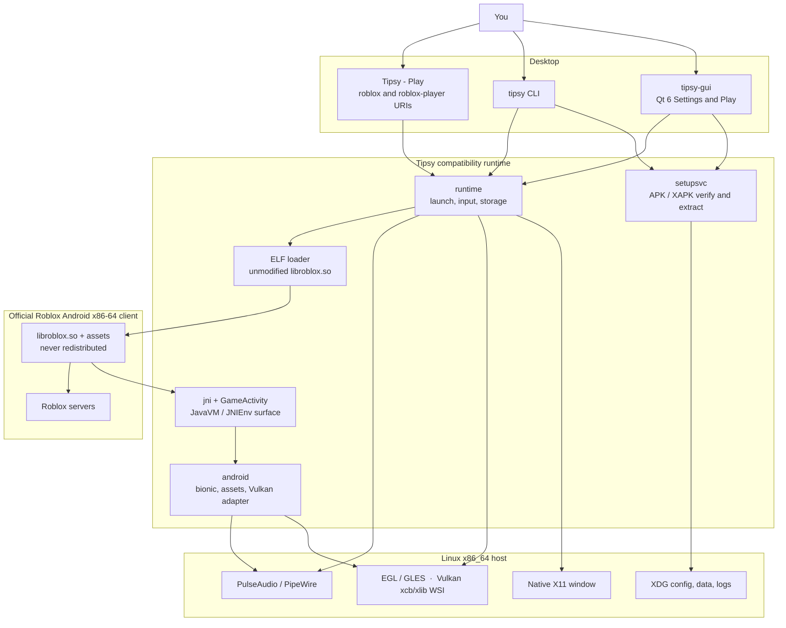

<div align="center">

<h1>
  
  Tipsy
</h1>

**Open-source Linux compatibility runtime for the official unmodified Roblox Android client.**

You supply a legitimate Android x86-64 package. Tipsy verifies it, extracts it into XDG directories, and runs it in a native X11 window — with enough Android / JNI / GameActivity compatibility for login, Home, and public experiences.

Roblox itself is proprietary and is **never** redistributed, patched, or committed here.

<br>

[](https://github.com/32bitx64bit/Tipsy/releases/latest)
[](LICENSE)
[](https://go.dev/dl/)
[](#requirements)

[Latest release](https://github.com/32bitx64bit/Tipsy/releases/latest)
· [AppImage](https://github.com/32bitx64bit/Tipsy/releases/latest)
· [Discord](https://discord.gg/YQkZx8JT6R)
· [Compile from source](#compile-from-source)

</div>

---

## Contents

- [Install](#install)
- [Start here](#start-here)
- [Requirements](#requirements)
- [Install the Roblox client](#install-the-roblox-client)
- [Play](#playing)
- [What works today](#what-works-today)
- [How Tipsy works](#how-tipsy-works)
- [Architecture](#architecture)
- [Compile from source](#compile-from-source)
- [Settings](#settings)
- [Command line](#command-line)
- [Logs and data](#logs-and-data)
- [What Tipsy is not](#what-tipsy-is-not)
- [Packaging](#packaging)
- [License](#license)

---

## Install

One copy-paste block per distro. Afterwards open **Tipsy - Settings** and run
the setup assistant to install the official Roblox client (never included).

> The APT, DNF, and Flatpak repositories populate with the first published
> release — until then, use the AppImage.

**Debian / Ubuntu**

```sh
sudo mkdir -p /etc/apt/keyrings
curl -fsSL https://32bitx64bit.github.io/Tipsy-repo/keys/tipsy-signing-key.asc \
  | sudo tee /etc/apt/keyrings/tipsy.asc > /dev/null
echo "deb [arch=amd64 signed-by=/etc/apt/keyrings/tipsy.asc] \
https://32bitx64bit.github.io/Tipsy-repo/apt stable main" \
  | sudo tee /etc/apt/sources.list.d/tipsy.list
sudo apt update
sudo apt install -y tipsy
```

**Fedora / compatible RPM systems**

```sh
sudo curl -fsSL -o /etc/yum.repos.d/tipsy.repo \
  https://32bitx64bit.github.io/Tipsy-repo/rpm/tipsy.repo
sudo dnf install -y tipsy
```

**Flatpak**

```sh
flatpak remote-add --if-not-exists tipsy \
  https://32bitx64bit.github.io/Tipsy-repo/flatpak/tipsy.flatpakrepo
flatpak install -y tipsy io.github.tipsy_linux.Tipsy
```

**AppImage (any distro)**

```sh
# Download Tipsy-<version>-x86_64.AppImage from
# https://github.com/32bitx64bit/Tipsy-repo/releases/latest
chmod +x Tipsy-*-x86_64.AppImage
./Tipsy-*-x86_64.AppImage
```

Updates arrive through your package manager (`apt upgrade`, `dnf upgrade`,
`flatpak update`). Only AppImage updates itself inside the app.

---

## Start here

> [!IMPORTANT]
> Tipsy does not include Roblox. Download Tipsy, then install an **official Android x86-64** `com.roblox.client` package through the setup assistant. ARM-only packages, Windows Roblox, and Roblox Studio are out of scope.

<table>
<tr>
<td width="50%" valign="top">

**New users — AppImage**

1. Download the latest **AppImage** from [Releases](https://github.com/32bitx64bit/Tipsy/releases/latest).
2. Mark it executable and run it.
3. First launch opens **Settings** when no client is installed.
4. Finish the setup assistant, then use **Tipsy - Play**.

```sh
chmod +x Tipsy-*-x86_64.AppImage
./Tipsy-*-x86_64.AppImage
```

The image never contains Roblox bytes. Use the in-app assistant, then Play.

</td>
<td width="50%" valign="top">

**At a glance**

- **Platform:** Linux x86_64, native X11
- **Client:** official Android x86-64 Roblox
- **Window:** native X11, not a full Android OS
- **Graphics:** OpenGL ES via EGL; Vulkan when Auto can probe a complete host path
- **Audio:** PulseAudio or PipeWire’s Pulse server
- **Credentials:** sign in inside Roblox’s own UI. Tipsy never asks for or logs passwords, cookies, or `.ROBLOSECURITY`

Prefer building it yourself? Jump to [Compile from source](#compile-from-source).

</td>
</tr>
</table>

Two desktop launchers after install:

| Launcher | What it does |
| --- | --- |
| **Tipsy - Play** | Starts the official client. Owns `roblox:` / `roblox-player:` website Play URIs. |
| **Tipsy - Settings** | Setup wizard, renderer, FPS, VSync, display, and diagnostics. |

Installed more than one way (say a Flatpak plus an AppImage)? One install owns
the launcher and the `roblox:` links at a time. An AppImage only adds itself
to the menu when nothing else provides Tipsy; **Settings → Desktop integration**
shows which install your menu opens and offers a one-click switch, and
`tipsy desktop status|adopt|release` does the same from a terminal. Builds from
source (`--mode developer` AppImages, `CHANNEL=dev` installs) appear separately
as **Tipsy-Dev - Play** / **Tipsy-Dev - Settings** and never take over the
launcher or URI handler of your real Tipsy install.

---

## Requirements

| Need | Detail |
| --- | --- |
| CPU / OS | Linux **x86_64** |
| Display | Native **X11** (`DISPLAY` set). Tipsy is X11-first, not a Wayland client. |
| GPU | Mesa (or equivalent) EGL / OpenGL ES. Vulkan is used when Auto can probe a complete host path (loader, physical device, xcb/xlib WSI). |
| Audio | PulseAudio or PipeWire’s Pulse server |
| Roblox | Official Android **x86-64** client (`com.roblox.client` with `lib/x86_64/libroblox.so`). Not included. |

ARM-only packages, Windows Roblox, and Roblox Studio are out of scope.

---

## Install the Roblox client

Setup only accepts an official x86-64 package it can cryptographically verify. Tampered or ARM-only archives fail closed.

1. Open **Tipsy - Settings** (`tipsy-gui`).
2. Run the setup assistant.
3. Choose **automatic download** (APKPure listing, then the same signature + ABI checks) or **local files** you obtained lawfully (Play-enabled device backup, XAPK, and similar).
4. Wait for extraction into the XDG data directory.

CLI equivalent for a package you already have:

```sh
tipsy setup /path/to/com.roblox.client.xapk
tipsy doctor
```

Installer APKs that are not Roblox (for example a store’s own downloader) are rejected. Extra language/ARM splits in a multi-ABI bundle are dropped; an ARM-only archive is not accepted.

Updating the client does not replace separately stored account data.

---

## Playing

```sh
tipsy-gui                 # Settings / first-run setup
tipsy launch              # official client on X11
tipsy launch --probe      # load + JNI_OnLoad only (no game loop)
tipsy launch 'roblox-player:1+launchmode:play+...'
```

Clicking Play on roblox.com can start Tipsy when the Play desktop file owns `roblox` / `roblox-player` (the install script registers this). Studio URIs are rejected. Joining a second place while the client is already running is not wired yet.

Sign in inside the official UI. Do not paste cookies into Tipsy.

---

## What works today

Tipsy is under active development. The following is user-visible on Linux X11 with a current official x86-64 client.

<table>
<tr>
<td width="50%" valign="top">

**Play**

- Official login screen on a native X11 window
- Sign-in through Roblox’s own UI
- Session kept across quit and relaunch the way the Android client would
- Join public experiences with rendering, keyboard, mouse, networking, and audio
- Website Play: `roblox-player:`, `roblox://`, and `https://www.roblox.com/games/...` URIs
- Dual launchers: **Play** skips the menu; **Settings** is setup and configuration

**Graphics and window**

- OpenGL ES via EGL on X11
- Vulkan when the host loader, a physical device, and xcb/xlib WSI are present (Auto prefers Vulkan)
- Resize, EWMH fullscreen, DPI-aware placement, and a default-monitor setting
- Frame-rate modes: Auto, Limited (30–240), or Unlimited (experimental uncapped request)
- Independent VSync (off by default)
- High-quality textures by default; optional low-texture mode to save memory

</td>
<td width="50%" valign="top">

**Input and audio**

- Keyboard, including held-key repeat
- Mouse, including captured relative look (RMB / shift-lock)
- Committed text in login, Home search, and in-experience chat (official `RbxKeyboard` path)
- Game audio through PulseAudio or PipeWire
- Optional Discord Rich Presence (off by default)

**Setup and tooling**

- Qt 6 setup wizard and settings window
- Cryptographic APK / signing-identity checks
- Local APK, APKM, XAPK, APKS, ZIP, or split sets
- Optional automatic download from APKPure as unofficial transport, then the same official-package verification
- CLI inspect, compare, doctor, and launch tools

</td>
</tr>
</table>

---

## How Tipsy works

Tipsy is **not** a reimplementation of Roblox, a Wine wrapper, or a full Android emulator. It is a **compatibility runtime**: the same official Android x86-64 `libroblox.so` that Google Play ships, running as a native Linux process.

That split is the whole design.

| Layer | Who owns it | What it does |
| --- | --- | --- |
| **Host UI** | Tipsy | Qt 6 Settings / Play, XDG paths, diagnostics. No game logic. |
| **Package gate** | Tipsy | Inspects APK / XAPK / splits, checks the Roblox signing identity and x86-64 ABI, then extracts into `~/.local/share/tipsy/`. |
| **Window & GPU** | Tipsy | Creates a real X11 window, binds EGL/GLES or translates Android Vulkan WSI onto xcb/xlib. |
| **Loader** | Tipsy | Maps the unmodified ELF (`PT_LOAD`, RELA, APS2 packed RELA) and resolves `DT_NEEDED` Android sonames to host shims. |
| **Android / JNI** | Tipsy | Enough bionic, JNI, and GameActivity behavior for the official client to start, log in, and present. Missing APIs fail honestly. |
| **Roblox** | Roblox | Login, Home, networking, experiences. Tipsy does not patch `libroblox.so` and does not ship it. |

Packages built by GitHub Actions — the AppImage, the Flatpak, and the `.deb`/`.rpm` from the signed repository — are treated as a verified Tipsy release. A **local build of any medium is not**: `build-appdir.sh`, `build-deb.sh`, `build-rpm.sh`, `build-flatpak.sh` and `install-desktop.sh` all default to a `development-unrestricted` marker, and only the publish workflow passes `--mode official`. The first `tipsy launch` / GUI Play from something you built yourself asks for explicit `--development` consent (or the Settings confirmation dialog). That records DevelopmentUnrestricted in owner-private config. It never claims OfficialVerified, and it still verifies the Roblox package.

---

## Architecture



**Call stack, in order, on a normal Play:**

1. **Authority** — GitHub-built AppImage, Flatpak, or repository package, or explicit development consent for a local build.
2. **Generation** — a previously verified extract; `tipsy setup` creates it.
3. **X11** — map the window (optional start-fullscreen) before any guest code runs.
4. **Graphics** — EGL-on-X11, or Vulkan Auto when the complete WSI path exists.
5. **Load** — map official `libroblox.so`, run constructors, `JNI_OnLoad`.
6. **GameActivity** — `initializeNativeCode` and the official start path.
7. **Present** — Roblox draws; Tipsy pumps X11, input, and audio around it.

The GUI (`cmd/tipsy-gui`) is presentation only. Package provenance, extraction, client settings, and launch live in shared Go packages used by both `tipsy` and `tipsy-gui`.

---

## Compile from source

> [!NOTE]
> Target is **Linux x86_64**. The CLI is Go-first. The GUI uses Qt 6 through [MIQT](https://github.com/mappu/miqt). Both binaries use cgo against X11, EGL/GLES, Pango/Cairo, and PulseAudio. Vulkan development headers are **not** required; the Vulkan path `dlopen`s the host loader at runtime.

### 1. Toolchain

GitHub Actions runs `gofmt`, then `go vet`, the full `go test` suite under Xvfb, and CLI/GUI builds on Ubuntu 22.04, Ubuntu 24.04, Debian Bookworm, and Fedora 43. Ubuntu 22.04’s `qt6-base-dev` 6.2.4 ships no Qt 6 pkg-config files; CI synthesizes them from `qmake6`.

| Tool | Version |
| --- | --- |
| Go | **1.27.1** (matches `go.mod` and CI) |
| C compiler | `gcc` or `g++` |
| pkg-config | required for native libraries and the Qt GUI |

Install Go from [go.dev/dl](https://go.dev/dl/) if your distro’s package is older.

### 2. Distribution packages

**Debian / Ubuntu** (same set CI uses):

```sh
sudo apt-get update
sudo apt-get install -y gcc g++ pkg-config \
  libx11-dev libx11-xcb-dev libxext-dev libxrandr-dev libxtst-dev libxi-dev \
  libegl1-mesa-dev libgles2-mesa-dev libgl1-mesa-dev libcairo2-dev \
  libpango1.0-dev libpulse-dev \
  qt6-base-dev qt6-base-dev-tools
```

**Fedora**

```sh
sudo dnf install golang gcc gcc-c++ pkgconf-pkg-config \
  qt6-qtbase-devel \
  libX11-devel libXext-devel libXrandr-devel libXtst-devel libXi-devel \
  mesa-libEGL-devel mesa-libGLES-devel mesa-libGL-devel \
  pango-devel cairo-devel pulseaudio-libs-devel
```

**Arch Linux / CachyOS**

```sh
sudo pacman -S --needed go gcc pkgconf qt6-base \
  libx11 libxext libxrandr libxtst libxi libxcb \
  mesa pango cairo libpulse
```

Optional at **runtime** (not a build dependency): a Mesa Vulkan ICD if you want Auto to prefer Vulkan.

### 3. Clone, check, build

```sh
git clone https://github.com/32bitx64bit/Tipsy.git
cd Tipsy

./scripts/bootstrap.sh
GOAMD64=v2 go test ./...
GOAMD64=v2 go build -o bin/tipsy ./cmd/tipsy
GOAMD64=v2 go build -o bin/tipsy-gui ./cmd/tipsy-gui
```

`bootstrap.sh` never fails with a one-liner: it reports Go, architecture, Qt, X11, and a C compiler, then tells you what is missing.

### 4. Install launchers (optional)

Install binaries and desktop files into `~/.local` (override with `PREFIX`):

```sh
./scripts/install-desktop.sh
```

That also registers `roblox` / `roblox-player` URI handling on the Play desktop file when `xdg-mime` is available. Put `~/.local/bin` on `PATH` if it is not already.

### 5. First launch from a source tree

A GitHub-built AppImage, Flatpak, or repository package can present as an official Tipsy release. Anything you built yourself cannot. Consent is explicit and sticky:

```sh
# Settings / wizard (GUI will prompt once)
bin/tipsy-gui

# or CLI
bin/tipsy setup --development /path/to/com.roblox.client.xapk
bin/tipsy launch --development
```

`--development` records DevelopmentUnrestricted in `~/.config/tipsy/config.json`. It does **not** skip Roblox APK verification and must not be described as OfficialVerified.

```sh
DISPLAY=:0 bin/tipsy launch --development
```

### 6. AppImage from source (optional)

Release AppImages are built by CI with a **pinned local** `appimagetool` (never downloaded implicitly) and do not contain APKs, `libroblox.so`, or Roblox fonts.

```sh
# Developer wrap used during packaging work:
#   scripts/build-appdir.sh
#   scripts/build-appimage.sh --appdir ... --tool /path/to/appimagetool --tool-sha256 ...
# Full signed release:
#   scripts/release-build.sh --version X.Y.Z --output-dir dist --mode github-signed ...
```

For everyday use, prefer the [published AppImage](https://github.com/32bitx64bit/Tipsy/releases/latest). Building a signed image needs the locked release inputs, a pinned `appimagetool`, and a clean tree; see `scripts/build-appimage.sh --help` and `.github/workflows/release.yml`.

---

## Settings

All of these live in **Tipsy - Settings** and in `~/.config/tipsy/client-settings.json`. Renderer, FPS, VSync, and texture quality need a Roblox restart.

| Setting | Behavior |
| --- | --- |
| Renderer | Auto (Vulkan when the full path exists, otherwise OpenGL), OpenGL, or Vulkan |
| Frame rate | Auto, Limited 30–240, Unlimited (not a guaranteed FPS) |
| VSync | Off by default; independent of the FPS cap |
| Low texture mode | Off by default (high quality); on saves memory/VRAM |
| Default monitor | Main monitor, a named output, or follow-mouse placement |
| Start fullscreen | Tipsy-owned window request at map time; not Roblox’s in-app fullscreen toggle |
| Discord Rich Presence | Off by default; optional join button stays off unless enabled |

---

## Command line

```
tipsy doctor              Host overview (OS, X11, GPU, audio, Qt, install)
tipsy inspect <apk...>    Inspect official APKs / splits
tipsy setup <apk...>      Verify and install
tipsy launch [--probe] [uri]
tipsy diagnose [subsystem]
tipsy diagnose-native <lib.so>
tipsy compare-roblox <old> <new>
tipsy report <apk...>
tipsy config              Show or edit XDG config
tipsy logs                Log directory and TIPSY_LOG help
tipsy version
```

Source-build flags: `tipsy setup --development`, `tipsy launch --development`.

Subsystems for `tipsy diagnose`: `x11`, `graphics`, `audio`, `jni`, `loader`, `roblox`, `auth`.

Machine-readable flags: `tipsy inspect --json`, `tipsy report --json`, `tipsy doctor --json`.

---

## Logs and data

XDG layout (override the usual `XDG_*_HOME` variables):

| Path | Typical location |
| --- | --- |
| Config | `~/.config/tipsy/` (`config.json`, `client-settings.json`) |
| Client install | `~/.local/share/tipsy/` |
| Logs | `~/.local/state/tipsy/` |

```sh
TIPSY_LOG=all TIPSY_LOG_LEVEL=debug tipsy launch
```

`TIPSY_LOG` is a comma-separated category list or `all`. Categories include `apk`, `loader`, `elf`, `android`, `jni`, `gameactivity`, `x11`, `graphics`, `input`, `audio`, `network`, `auth`, `filesystem`, `qt`, and `runtime`.

Diagnostics never print passwords, cookies, tokens, or `.ROBLOSECURITY`.

---

## What Tipsy is not

<table>
<tr>
<td width="50%" valign="top">

**Not**

- A source of Roblox APKs, `.so` files, or assets
- A cheat, injector, executor, or anti-cheat bypass
- A Windows-Roblox / Wine wrapper
- A complete Android OS
- Roblox Studio

</td>
<td width="50%" valign="top">

**Still limited or unverified**

- Microphone capture is not advertised and remains unverified
- Gamepads / controllers are not implemented
- Native Wayland is not the display target
- In-experience join while a session is already running is not wired
- Horizontal mouse wheel is captured but the current Android client only consumes vertical scroll
- `tipsy repair` is not implemented; use `tipsy setup` to re-extract

</td>
</tr>
</table>

Performance claims versus other Linux Roblox runtimes are out of scope until they are measured.

---

## Packaging

`scripts/build-appdir.sh` produces a versioned AppDir and archive with bundled Qt/XCB runtime libraries and license notices. `scripts/build-appimage.sh` wraps that AppDir with a **pinned local** `appimagetool`. Payloads are guarded: no APK, `libroblox.so`, or Roblox fonts.

`packaging/deb`, `packaging/rpm`, and `packaging/flatpak` build the native
packages and the Flatpak bundle (KDE 6.10 runtime, Go from the Flathub SDK
extension) that every publish pushes to the self-hosted APT/RPM/Flatpak
repositories. Native packages never replace AppImage.

---

## License

Tipsy is [GPL-3.0-or-later](LICENSE). See [NOTICE](NOTICE) for third-party notes.

Roblox is copyright Roblox Corporation and is not part of this project. Users must obtain official packages through legitimate channels.
