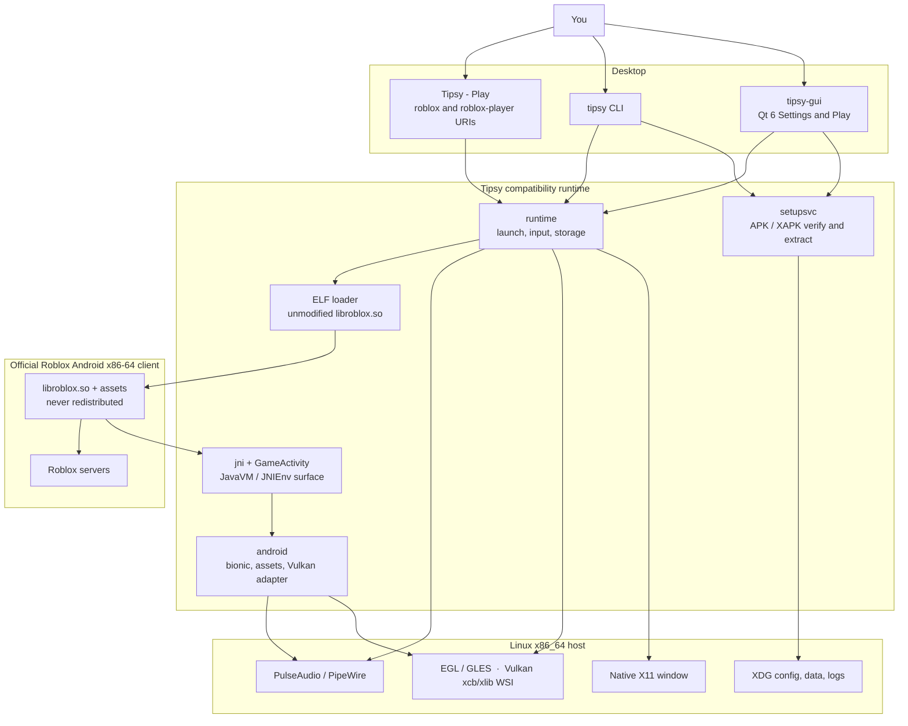

<div align="center">

<h1>
  
  Tipsy
</h1>

**Play official Roblox on Linux.**

Tipsy runs the **unmodified Android x86-64 Roblox client** in a native X11 window.
You provide a legitimate package. Tipsy verifies it, extracts it, and supplies the
Android / JNI / GameActivity compatibility the client needs.

The runtime is **ours** — loader, JNI, GameActivity, X11, graphics, input, and
audio — written for this project, not lifted from another stack.
**Stable releases** are playtested by the maintainer against everything listed
as working.

Roblox is not included, not patched, and not redistributed.

<br>

[](https://tipsyhq.org)
[](https://github.com/32bitx64bit/Tipsy/releases/latest)
[](LICENSE)
[](https://discord.gg/YQkZx8JT6R)

[Website](https://tipsyhq.org)
· [Download](https://github.com/32bitx64bit/Tipsy/releases/latest)
· [Discord](https://discord.gg/YQkZx8JT6R)
· [Contributing](CONTRIBUTING.md)

</div>

---

## Contents

- [Why Tipsy](#why-tipsy)
- [Get started](#get-started)
- [What you need](#what-you-need)
- [What works today](#what-works-today)
- [Everyday use](#everyday-use)
- [Not supported](#not-supported)
- [Developers and power users](#developers-and-power-users)
  - [How it works](#how-it-works)
  - [Command line](#command-line)
  - [Logs, config, and data](#logs-config-and-data)
  - [Compile from source](#compile-from-source)
  - [Packaging](#packaging)
  - [License](#license)

---

## Why Tipsy

Other Linux Roblox projects exist. Tipsy is a different kind of stack: a
from-scratch compatibility runtime around the **official** Android client, with
releases that have actually been played.

<table>
<tr>
<td width="33%" valign="top">

**Built in-house**

ELF loader, JavaVM/JNI, GameActivity, native X11, EGL and Vulkan, input, and
audio are Tipsy code. GPL-3.0-or-later. You can read it. We do not vendor or
re-skin another project's internals.

</td>
<td width="33%" valign="top">

**Official client, unmodified**

The same `libroblox.so` Google Play ships. Tipsy does not patch the engine,
does not ship Roblox bytes, and does not ask you to run a Windows build under
a wrapper.

</td>
<td width="33%" valign="top">

**Stable means playtested**

Tagged stable releases are run through real sessions by the maintainer:
login, Home, public experiences, text, input, audio, and the rest of
[what works today](#what-works-today). If it is on that list, that build is
meant to do it. Nightlies and source trees are development.

</td>
</tr>
</table>

Go-first host, Qt only for Settings/Play, X11-first on the desktop. Compatibility
is added from observed client failures — not a speculative Android reimplementation.

---

## Get started

Three steps. Roblox is installed **inside Tipsy**, never shipped with it.

### 1. Install Tipsy

**Package (recommended)** — one command detects Debian/Ubuntu, Fedora/RHEL,
Arch/CachyOS, or Flatpak:

```sh
curl -fsSL https://32bitx64bit.github.io/Tipsy-repo/install.sh | sudo bash
```

Prefer to review the steps first? See the
[repository install guide](https://github.com/32bitx64bit/Tipsy-repo/blob/main/docs/INSTALL.md).

**AppImage** — no repository, any distro:

1. Download `Tipsy-<version>-x86_64.AppImage` from
   [Releases](https://github.com/32bitx64bit/Tipsy/releases/latest).
2. Make it executable and run it:

```sh
chmod +x Tipsy-*-x86_64.AppImage
./Tipsy-*-x86_64.AppImage
```

Official builds need a CPU with **AVX2** (Intel Haswell 2013+, AMD Excavator 2015+
or Zen). If the AppImage exits immediately, that is the usual cause.

### 2. Install the Roblox client

Open **Tipsy - Settings**. First launch does this automatically when no client is
installed.

1. Run the setup assistant.
2. Choose **automatic download** or **local files** you obtained lawfully
   (Play-enabled device backup, XAPK, and similar).
3. Wait while Tipsy verifies the official x86-64 package and extracts it.

Only a cryptographically verified `com.roblox.client` with
`lib/x86_64/libroblox.so` is accepted. ARM-only packages, Windows Roblox,
Studio, and store installer APKs fail closed.

Already have a package on disk?

```sh
tipsy setup /path/to/com.roblox.client.xapk
tipsy doctor
```

Updating the client does not replace separately stored account data.

### 3. Play

- **Tipsy - Play** starts the client.
- Or click Play on [roblox.com](https://www.roblox.com) once the Play launcher
  owns `roblox:` / `roblox-player:` (the install script registers this).
- Sign in **inside Roblox’s own UI**. Tipsy never asks for a password, cookie,
  or `.ROBLOSECURITY`.

```sh
tipsy-gui          # Settings / first-run setup
tipsy launch       # official client on X11
```

---

## What you need

| | |
| --- | --- |
| **OS** | Linux on **x86_64-v3** (AVX2) |
| **Display** | Native **X11** (`DISPLAY` set). Tipsy is not a Wayland client; an Xwayland session can work. |
| **GPU** | Mesa (or equivalent) EGL / OpenGL ES. Vulkan is used when Auto can see a complete host path. |
| **Audio** | PulseAudio or PipeWire’s Pulse server |
| **Roblox** | Official Android **x86-64** client — not included |

---

## What works today

Tipsy is under active development. This is what is user-visible on Linux X11
with a current official x86-64 client.

<table>
<tr>
<td width="50%" valign="top">

**Play**

- Official login on a native X11 window
- Sign-in through Roblox’s own UI
- Session kept across quit and relaunch the way the Android client would
- Public experiences: rendering, keyboard, mouse, networking, audio
- Website Play: `roblox-player:`, `roblox://`, and `https://www.roblox.com/games/...`
- Dual launchers: **Play** skips the menu; **Settings** is setup and configuration

**Graphics and window**

- OpenGL ES via EGL on X11
- Vulkan when the host loader, a physical device, and xcb/xlib WSI are present (Auto prefers Vulkan)
- Focused text (login, Home search, in-experience chat) on the official keyboard path, including compositor-off Vulkan
- Resize, EWMH fullscreen, DPI-aware placement, default-monitor setting
- Frame rate: Auto, Limited (30–240), or Unlimited (uncapped *request*, not a guaranteed FPS)
- Independent VSync (off by default)
- High-quality textures by default; optional low-texture mode to save memory

</td>
<td width="50%" valign="top">

**Input and audio**

- Keyboard, including held-key repeat
- Mouse, including captured relative look (RMB / shift-lock)
- Typed text in login, search, and chat
- Gamepads / controllers over evdev (Xbox, DualShock, DualSense, Switch Pro, 8BitDo, and similar; Bluetooth pairing is the desktop’s job)
- Game audio through PulseAudio or PipeWire
- Voice chat for eligible accounts (hear and talk)
- Optional Discord Rich Presence (off by default)

**Setup**

- Qt 6 setup wizard and settings window
- Cryptographic APK / signing-identity checks
- Local APK, APKM, XAPK, APKS, ZIP, or split sets
- Optional APKPure download as transport, then the same official-package verification
- CLI inspect, compare, doctor, and launch tools

</td>
</tr>
</table>

---

## Everyday use

### Launchers

| Launcher | What it does |
| --- | --- |
| **Tipsy - Play** | Starts the official client. Owns `roblox:` / `roblox-player:` website Play URIs. |
| **Tipsy - Settings** | Setup wizard, renderer, FPS, VSync, display, controllers, and diagnostics. |

### Settings that need a Roblox restart

These live in **Tipsy - Settings** and in `~/.config/tipsy/client-settings.json`.

| Setting | Behavior |
| --- | --- |
| Renderer | Auto (Vulkan when the full path exists, otherwise OpenGL), OpenGL, or Vulkan |
| Frame rate | Auto, Limited 30–240, Unlimited (not a guaranteed FPS) |
| VSync | Off by default; independent of the FPS cap |
| Low texture mode | Off by default (high quality); on saves memory/VRAM |
| Default monitor | Main monitor, a named output, or follow-mouse placement |
| Start fullscreen | Tipsy-owned window request at map time; not Roblox’s in-app fullscreen toggle |
| Discord Rich Presence | Off by default; optional join button stays off unless enabled |

### Controllers

Most pads just work on a local graphical login (logind `uaccess` on
`/dev/input`). If the client sees no controller:

1. Plug in or pair the pad in the desktop Bluetooth settings.
2. Run `tipsy diagnose gamepad` (or **Settings** diagnostics).
3. If you see permission errors: log in locally (not a bare `ssh` session), or
   `sudo usermod -aG input "$USER"` and **relogin**. Never run Tipsy as root.

Flatpak needs device access (`--device=all` on Flatpak 1.14). Existing installs
can opt in with Flatseal or:

```sh
flatpak override --user --device=all io.github.tipsy_linux.Tipsy
```

### Microphone / voice chat

Unmute **Roblox microphone** in `pavucontrol` (or your desktop mixer) if the
game cannot hear you. The in-game device list only offers the host default;
pick the source on the desktop, or pin it with `TIPSY_MICROPHONE_SOURCE`.

### More than one install

A Flatpak plus an AppImage can coexist. **One** install owns the menu and
`roblox:` links at a time. An AppImage only adds itself to the menu when
nothing else provides Tipsy. **Settings → Desktop integration** shows which
install your menu opens; `tipsy desktop status|adopt|release` does the same
from a terminal.

Source builds and `--mode developer` AppImages appear as **Tipsy-Dev** and
never take over the launcher of an official Tipsy install.

Updates: `apt upgrade`, `dnf upgrade`, `pacman -Syu`, or `flatpak update`.
AppImage updates itself inside the app.

---

## Not supported

| | |
| --- | --- |
| Windows Roblox, Wine, or Roblox Studio | Out of scope |
| ARM-only or tampered packages | Rejected |
| Native Wayland | X11-first; use an X11 session or Xwayland |
| Cheats, injectors, executors, anti-cheat bypass | Never |
| Shipping Roblox APKs / `.so` files | Never |
| Joining a second place while the client is already running | Not wired yet |
| Horizontal mouse wheel | Captured; the current Android client only consumes vertical scroll |
| `tipsy repair` | Use `tipsy setup` to re-extract |

Performance comparisons versus other Linux Roblox runtimes are out of scope
until they are measured. Tipsy does not collect Roblox credentials.

---

## Developers and power users

[Contributing](CONTRIBUTING.md) is the engineering contract. The rest of this
page is how the runtime is structured, how to build it, and how to drive it
from a terminal.

### How it works

Tipsy is **not** a Roblox reimplementation, a Wine wrapper, or a full Android
emulator. It is a **compatibility runtime**: the same official Android x86-64
`libroblox.so` that Google Play ships, running as a native Linux process.

| Layer | Owner | Role |
| --- | --- | --- |
| Host UI | Tipsy | Qt 6 Settings / Play, XDG paths, diagnostics. No game logic. |
| Package gate | Tipsy | Inspects APK / XAPK / splits, checks the Roblox signing identity and x86-64 ABI, extracts into `~/.local/share/tipsy/`. |
| Window and GPU | Tipsy | Real X11 window; EGL/GLES or Android Vulkan WSI on xcb/xlib. |
| Loader | Tipsy | Maps the unmodified ELF (`PT_LOAD`, RELA, APS2 packed RELA) and resolves `DT_NEEDED` Android sonames to host shims. |
| Android / JNI | Tipsy | Enough bionic, JNI, and GameActivity for the official client to start, log in, and present. Missing APIs fail honestly. |
| Roblox | Roblox | Login, Home, networking, experiences. Tipsy does not patch `libroblox.so` and does not ship it. |

GitHub Actions packages (AppImage, Flatpak, `.deb` / `.rpm` / pacman from the
signed repository) present as a verified Tipsy release. A **local build of any
medium is not**. `build-appdir.sh` and the distro packagers default to
`development-unrestricted`; only the publish workflow passes `--mode official`.
The first `tipsy launch` / GUI Play from something you built yourself asks for
`--development` (or the Settings confirmation). That records
DevelopmentUnrestricted in owner-private config. It never claims
OfficialVerified, and it still verifies the Roblox package.



**Call stack on a normal Play**

1. **Authority** — GitHub-built AppImage, Flatpak, or repository package, or explicit development consent for a local build.
2. **Generation** — a previously verified extract (`tipsy setup`).
3. **X11** — map the window (optional start-fullscreen) before any guest code runs.
4. **Graphics** — EGL-on-X11, or Vulkan Auto when the complete WSI path exists.
5. **Load** — map official `libroblox.so`, run constructors, `JNI_OnLoad`.
6. **GameActivity** — `initializeNativeCode` and the official start path.
7. **Present** — Roblox draws; Tipsy pumps X11, input, and audio around it.

The GUI (`cmd/tipsy-gui`) is presentation only. Package provenance, extraction,
client settings, and launch live in shared Go packages used by both `tipsy` and
`tipsy-gui`.

### Command line

```
tipsy doctor              Host overview (OS, X11, GPU, audio, Qt, gamepad, install)
tipsy inspect <apk...>    Inspect official APKs / splits
tipsy setup <apk...>      Verify and install
tipsy launch [--probe] [uri]
tipsy diagnose [subsystem]
tipsy diagnose-native <lib.so>
tipsy compare-roblox <old> <new>
tipsy report <apk...>
tipsy config              Show or edit XDG config
tipsy desktop             status | adopt | release | render
tipsy logs                Log directory and TIPSY_LOG help
tipsy version
```

Source-build flags: `tipsy setup --development`, `tipsy launch --development`.

`tipsy diagnose` subsystems: `x11`, `graphics`, `audio`, `jni`, `loader`,
`roblox`, `auth`, `gamepad` (aliases `pad`, `controller`).

Machine-readable: `tipsy inspect --json`, `tipsy report --json`,
`tipsy doctor --json`.

```sh
tipsy launch --probe
tipsy launch 'roblox-player:1+launchmode:play+...'
DISPLAY=:0 tipsy launch --development
```

`--probe` loads + `JNI_OnLoad` only (no game loop). Studio URIs are rejected.
A website Play URI that includes an official authentication ticket signs the
Android session in through the same private cookie store as in-app login.
Ticket and cookie values are never logged.

One-launch OpenGL visual test (does not persist renderer settings):

```sh
TIPSY_TEST_RENDERER=opengl tipsy launch
```

### Logs, config, and data

XDG layout (override with the usual `XDG_*_HOME` variables):

| Path | Typical location |
| --- | --- |
| Config | `~/.config/tipsy/` (`config.json`, `client-settings.json`) |
| Client install | `~/.local/share/tipsy/` |
| Logs | `~/.local/state/tipsy/` |

```sh
TIPSY_LOG=all TIPSY_LOG_LEVEL=debug tipsy launch
```

`TIPSY_LOG` is a comma-separated category list or `all`. Categories include
`apk`, `loader`, `elf`, `android`, `jni`, `gameactivity`, `x11`, `graphics`,
`input`, `audio`, `network`, `auth`, `filesystem`, `qt`, and `runtime`.

Diagnostics never print passwords, cookies, tokens, or `.ROBLOSECURITY`.

<details>
<summary>Controller and microphone environment (optional)</summary>

Env wins over the matching section in the settings file. Missing JSON uses defaults.

```
TIPSY_GAMEPAD=0                    Whole subsystem off
TIPSY_GAMEPAD_DEADZONE=0.0-0.5     Stick deadzone floor
TIPSY_GAMEPAD_INVERT_Y=1           Invert both stick Y axes
TIPSY_GAMEPAD_RUMBLE=0|1           Rumble preference
TIPSY_GAMEPAD_DEBUG=1              Per-event logging (off by default)

TIPSY_MICROPHONE=0                 Capture off
TIPSY_MICROPHONE=1                 Force on
TIPSY_MICROPHONE_SOURCE=<name>     Pin a Pulse source (unset = host default)
```

`tipsy diagnose` never prints Pulse source names or input values.

</details>

### Compile from source

> [!NOTE]
> Target is **Linux x86_64-v3** (`GOAMD64=v3`, AVX2). The CLI is Go-first. The
> GUI uses Qt 6 through [MIQT](https://github.com/mappu/miqt). Both binaries use
> cgo against X11, EGL/GLES, Pango/Cairo, and PulseAudio. Vulkan development
> headers are **not** required; the Vulkan path `dlopen`s the host loader at
> runtime.

GitHub Actions runs `gofmt`, `go vet`, the full `go test` suite under Xvfb, and
CLI/GUI builds on Ubuntu 22.04, Ubuntu 24.04, Debian Bookworm, and Fedora 43.
Ubuntu 22.04’s `qt6-base-dev` 6.2.4 ships no Qt 6 pkg-config files; CI
synthesizes them from `qmake6`.

| Tool | Version |
| --- | --- |
| Go | **1.27.1** (matches `go.mod` and CI) |
| C compiler | `gcc` or `g++` |
| pkg-config | required for native libraries and the Qt GUI |

Install Go from [go.dev/dl](https://go.dev/dl/) if your distro’s package is older.

<details>
<summary>Distribution packages</summary>

**Debian / Ubuntu** (same set CI uses):

```sh
sudo apt-get update
sudo apt-get install -y gcc g++ pkg-config \
  libx11-dev libx11-xcb-dev libxext-dev libxrandr-dev libxtst-dev libxi-dev libxdamage-dev \
  libegl1-mesa-dev libgles2-mesa-dev libgl1-mesa-dev libcairo2-dev \
  libpango1.0-dev libpulse-dev \
  libgtk-3-dev libwebkit2gtk-4.1-dev libvulkan-dev \
  qt6-base-dev qt6-base-dev-tools
```

**Fedora**

```sh
sudo dnf install golang gcc gcc-c++ pkgconf-pkg-config \
  qt6-qtbase-devel \
  libX11-devel libXext-devel libXrandr-devel libXtst-devel libXi-devel libXdamage-devel \
  mesa-libEGL-devel mesa-libGLES-devel mesa-libGL-devel \
  pango-devel cairo-devel pulseaudio-libs-devel \
  gtk3-devel webkit2gtk4.1-devel vulkan-headers vulkan-loader-devel
```

**Arch Linux / CachyOS**

```sh
sudo pacman -S --needed go gcc pkgconf qt6-base \
  libx11 libxext libxrandr libxtst libxi libxdamage libxcb \
  mesa pango cairo libpulse gtk3 webkit2gtk-4.1 vulkan-headers vulkan-icd-loader
```

Optional at **runtime** (not a build dependency): a Mesa Vulkan ICD if you want
Auto to prefer Vulkan.

</details>

```sh
git clone https://github.com/32bitx64bit/Tipsy.git
cd Tipsy

./scripts/bootstrap.sh
GOAMD64=v3 go test ./...
GOAMD64=v3 go build -o bin/tipsy ./cmd/tipsy
GOAMD64=v3 go build -o bin/tipsy-gui ./cmd/tipsy-gui
```

`bootstrap.sh` reports Go, architecture, AVX2, Qt, X11, and a C compiler, then
tells you what is missing. On a CPU without AVX2, `GOAMD64=v2` still compiles a
local fallback; that is not an official release target.

Install binaries and desktop files into `~/.local` (override with `PREFIX`):

```sh
./scripts/install-desktop.sh
```

That also registers `roblox` / `roblox-player` URI handling on the Play desktop
file when `xdg-mime` is available. Put `~/.local/bin` on `PATH` if it is not
already.

A GitHub-built AppImage, Flatpak, or repository package can present as an
official Tipsy release. Anything you built yourself cannot. Consent is explicit
and sticky:

```sh
bin/tipsy-gui
bin/tipsy setup --development /path/to/com.roblox.client.xapk
DISPLAY=:0 bin/tipsy launch --development
```

`--development` records DevelopmentUnrestricted in `~/.config/tipsy/config.json`.
It does **not** skip Roblox APK verification and must not be described as
OfficialVerified.

### Packaging

`scripts/build-appdir.sh` produces a versioned AppDir and archive with bundled
Qt/XCB runtime libraries and license notices. `scripts/build-appimage.sh` wraps
that AppDir with a **pinned local** `appimagetool`. Payloads are guarded: no APK,
`libroblox.so`, or Roblox fonts.

```sh
# Developer wrap used during packaging work:
#   scripts/build-appdir.sh
#   scripts/build-appimage.sh --appdir ... --tool /path/to/appimagetool --tool-sha256 ...
# Full signed release:
#   scripts/release-build.sh --version X.Y.Z --output-dir dist --mode github-signed ...
```

For everyday use, prefer the
[published AppImage](https://github.com/32bitx64bit/Tipsy/releases/latest).
Building a signed image needs the locked release inputs, a pinned
`appimagetool`, and a clean tree; see `scripts/build-appimage.sh --help` and
`.github/workflows/release.yml`.

`packaging/deb`, `packaging/rpm`, `packaging/arch`, and `packaging/flatpak`
build the native packages and the Flatpak bundle (KDE 6.10 runtime, Go from the
Flathub SDK extension) that every publish pushes to the self-hosted
APT/RPM/pacman/Flatpak repositories. Native packages never replace AppImage.

### License

Tipsy is [GPL-3.0-or-later](LICENSE). See [NOTICE](NOTICE) for third-party notes.

Roblox is copyright Roblox Corporation and is not part of this project. Users
must obtain official packages through legitimate channels.
